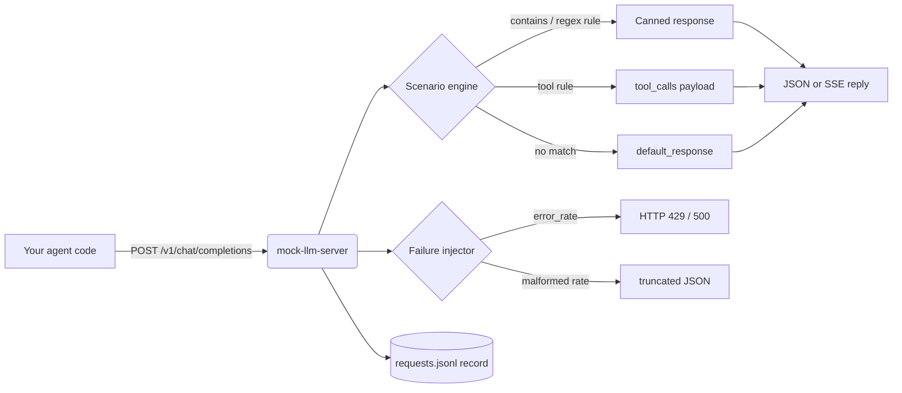

# mock-llm-server

A local, OpenAI-compatible stub LLM server for testing agent and LLM-app code — **no API keys, no network, no cost**. Point your code at `http://localhost:11434/v1` and get deterministic canned responses, tool calls, streaming, and chaos-style failure injection.

## Why

Testing agent loops against real APIs is slow, flaky, and expensive. `mock-llm-server` gives you:

- **Deterministic canned responses** matched by keyword or regex — your tests stop depending on model whims.
- **Tool-call emission** (`get_weather`, `add`, `web_search`, …) with arguments extracted from the prompt via regex, so you can test tool-use loops end to end.
- **SSE streaming** support, so streaming clients work unchanged.
- **Failure injection** — latency, error rates (429/500), and malformed-JSON rates — to harden retry and parsing logic.
- **Request recording** to JSONL, so you can assert exactly what your agent sent.

## Architecture



## Quickstart

```bash
pip install -r requirements.txt   # pytest only; the server itself is stdlib-only

# 1. start the stub (default assistant scenario)
python -m mockllm --scenario scenarios/assistant.json

# 2. in another terminal, talk to it like OpenAI
curl -s http://127.0.0.1:11434/v1/chat/completions \
  -H 'Content-Type: application/json' \
  -d '{"model":"mock-gpt-1","messages":[{"role":"user","content":"tell me a joke"}]}'
```

Or run the zero-API-key demo:

```bash
python demo.py
```

### Point an OpenAI client at it

```python
from openai import OpenAI
client = OpenAI(base_url="http://127.0.0.1:11434/v1", api_key="mock")
resp = client.chat.completions.create(
    model="mock-gpt-1",
    messages=[{"role": "user", "content": "weather in Paris"}],
)
print(resp.choices[0].message.tool_calls[0].function.arguments)
# {"location": "Paris"}
```

### Failure injection

```bash
# flaky scenario: 300ms latency, 30% HTTP 500s, 10% truncated JSON
python -m mockllm --scenario scenarios/flaky.json

# or override any scenario from the CLI
python -m mockllm --scenario scenarios/assistant.json --latency-ms 200 --error-rate 0.2 --seed 42
```

### Request recording

```bash
python -m mockllm --record requests.jsonl
# every request body is appended as one JSON line: {"n": 1, "path": ..., "body": {...}}
```

## Scenarios

Scenarios are plain JSON in `scenarios/`. A rule matches the last user message:

| Key | Meaning |
|---|---|
| `match.contains` | substring (or list) matched case-insensitively |
| `match.regex` | regex matched case-insensitively |
| `response` | string, `null` (pure tool-call turn), or list (rotated round-robin) |
| `tool_calls[].name` | function name to emit |
| `tool_calls[].args` | static JSON arguments |
| `tool_calls[].args_from_regex` | regex with named groups → arguments extracted from the prompt |
| `failure.latency_ms` / `error_rate` / `error_status` / `malformed_json_rate` | chaos knobs |

Bundled scenarios: `assistant.json` (friendly defaults), `tool-calling.json` (calculator + search tools), `flaky.json` (chaos testing).

## Endpoints

| Method | Path | Description |
|---|---|---|
| `POST` | `/v1/chat/completions` | chat completions; `"stream": true` gives SSE |
| `GET` | `/v1/models` | lists the mock model |
| `GET` | `/health` | liveness probe + active scenario name |

## Tests

```bash
pytest -q   # 20 tests: matching, tool calls, SSE, failure injection, recording
```

## Project layout

```
mock-llm-server/
├── mockllm/
│   ├── __init__.py      # public API
│   ├── __main__.py      # python -m mockllm
│   ├── cli.py           # argument parsing, server bootstrap
│   ├── scenarios.py     # Scenario: rule matching, rotation, tool-call rendering
│   └── server.py        # ThreadingHTTPServer + OpenAI-compatible handlers
├── scenarios/           # assistant.json, tool-calling.json, flaky.json
├── tests/               # pytest suite (stdlib HTTP client, ephemeral ports)
├── demo.py              # zero-API-key end-to-end demo
└── pyproject.toml       # console script: mock-llm-server
```

## License

MIT — see [LICENSE](LICENSE).
